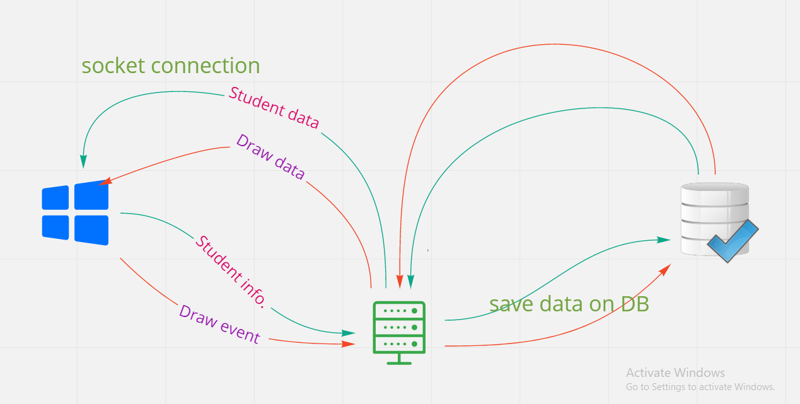

# whiteboard-project

Auther: Abeer Rafati & Enas Bataineh

This app present a whiteboard canvas let the instructor explain something in whiteboard and the students can show that in them room ...

[Demo](https://confident-thompson-738bd4.netlify.app/)

To use this app:

clone this repo

Download all dependencies used in this app, use in terminal
`npm i`

Run the server use in terminal
`nodemon`

Go inside the client folder and Run in termintl
`npm start`

AND ENJOY !!!

